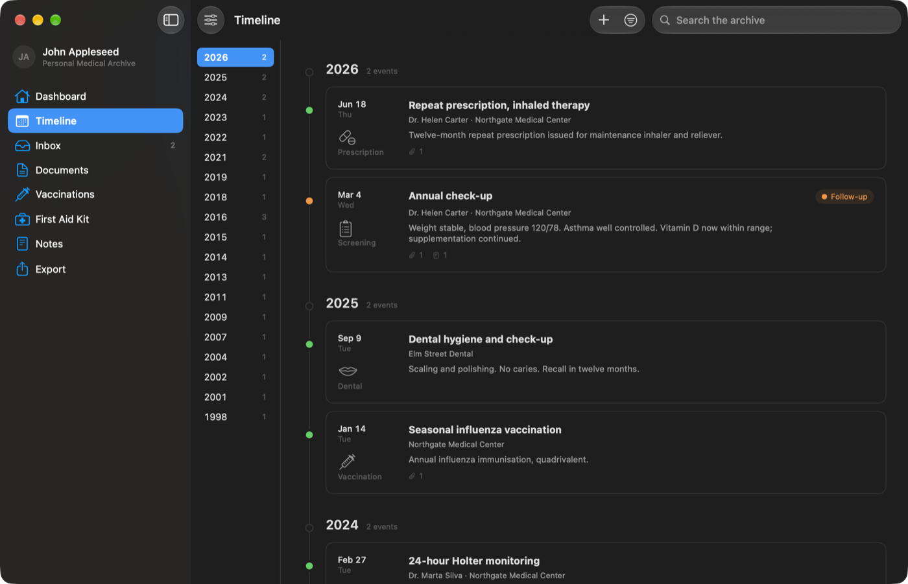
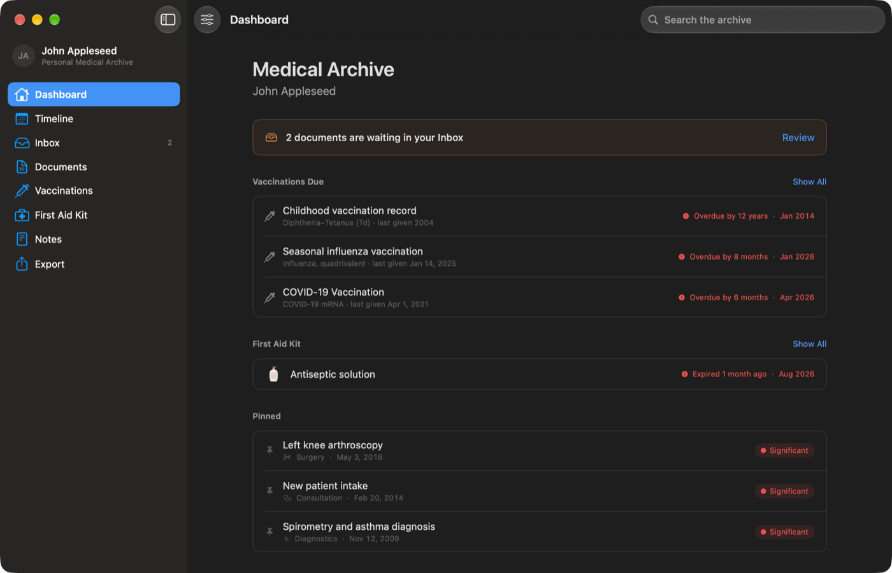
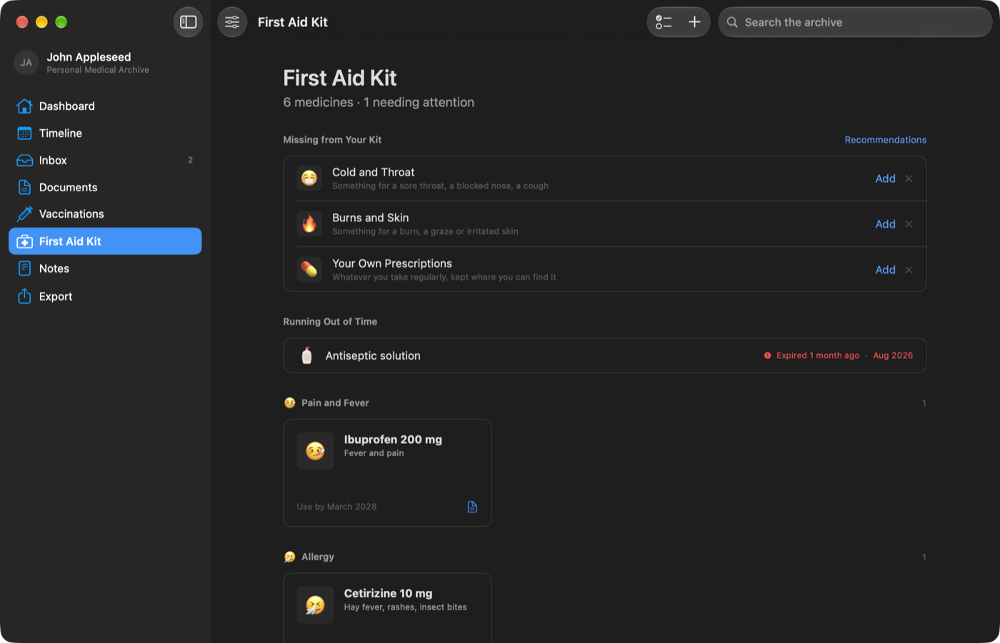
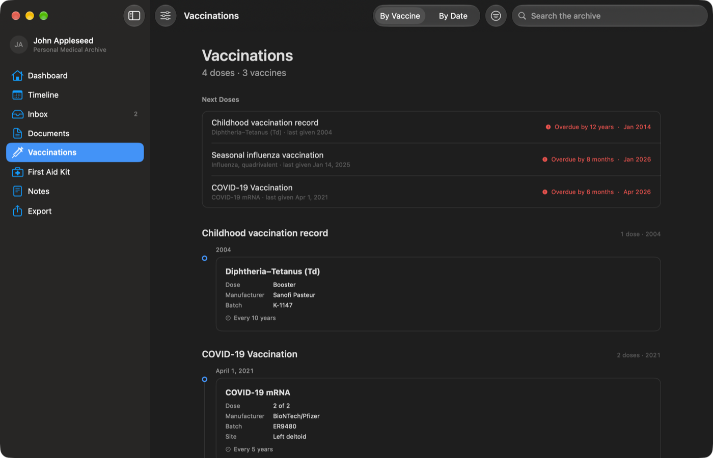

# Medical

A personal medical archive for macOS. Every document you own, in one folder you
own — plain files and readable JSON, on this Mac and nowhere else.

It is not an electronic medical record and has no clinical authority of its own.
It is the place to keep a lifetime of paperwork so that, twenty years later, a
question like *"when was my last tetanus booster"* or *"what did that MRI say"*
takes seconds rather than an afternoon with a shoebox.



## Why it works this way

**The library is a folder, not a database.** `Archive.json` is pretty-printed,
human-readable JSON with ordinary words for keys. `Originals/` holds the files
you imported, untouched, filed by year. A folder found in twenty years explains
itself without this application — and that is the point.

**Nothing leaves the Mac.** No account, no sync, no telemetry, no AI. The app
contains no networking code at all.

**Originals are never modified.** Imported files are copied in, made read-only
and hashed. What the app adds is a layer of records *over* those files; the
evidence underneath stays exactly as it was scanned.

**Writes are atomic, with snapshots.** Every save goes through a temporary file
and an atomic replace, and the previous version of `Archive.json` is kept in
`Snapshots/`. A power cut leaves either the old archive or the new one, never
half of either.

## What is in it

| | |
|---|---|
| **Dashboard** | What needs doing: boosters due, medicines running out, unfiled scans, pinned records |
| **Timeline** | A life on one continuous thread, with a rail of years down the side |
| **Inbox** | Import a hundred scans in an afternoon, file them over the following months |
| **Documents** | The library itself: format, pages, and which records cite the document |
| **Vaccinations** | Every dose grouped by what it was against, with batch numbers and boosters |
| **First Aid Kit** | The cupboard at home: expiry reminders and a checklist of what a kit usually covers |
| **Notes** | Everything no form has a field for |
| **Export** | A doctor-ready report, or the whole library as a zip |

 

### The Doctor Report

One package to hand to a doctor: a readable PDF — chronology, every dose, every
result — plus the exact scanned pages the records cite, and nothing else. Where a
record cites three pages of a ninety-page childhood card, three pages are what
comes out. You choose which sections to include, and the list shows only the
sections that actually have something in them.

### Vaccinations

Doses are grouped by what the record is *for*, not by the product name, so a
course given as BCG and later as BCG-M reads as one history with one booster
clock — which is also how the reminders count it.



## The library on disk

```
~/Library/Application Support/Medical/
└── Medical Library/
    ├── Archive.json      every record, in readable JSON
    ├── Library.json      format version, archive id, a note explaining the folder
    ├── Originals/
    │   └── 2016/         imported files, read-only, filed by year
    ├── Snapshots/        previous versions of Archive.json
    └── Removed/          originals taken out of the archive but not destroyed
```

Nothing in the app ever writes into `Originals/` after an import. Taking a
document out of the archive moves the file to `Removed/`, so the bytes are still
there if the decision turns out to have been wrong.

The folder can be moved, renamed, copied to another Mac or backed up with Time
Machine. Several libraries can live side by side — **Export → Libraries…**
switches between them. It sits in Application Support rather than Documents
partly so that it is not swept into iCloud Drive along with everything else.

## Installing

Download the `.dmg` from [Releases](../../releases) and drag **Medical** to
Applications. One universal build, Apple Silicon and Intel. **Requires macOS 26.**

The app is signed ad-hoc rather than with a paid Apple Developer certificate, so
the first launch is refused: *"Apple could not verify Medical is free of
malware."* To open it anyway, go to **System Settings → Privacy & Security**,
scroll to the bottom, and press **Open Anyway** next to the message about
Medical. macOS asks once; after that it launches normally.

If you would rather not take that on faith — a reasonable position for an
application that will hold your medical records — build it yourself instead. The
source here is all of it.

## Building

Requires macOS 26 and Xcode 26 (Swift 6).

```bash
git clone https://github.com/Ta2-me2/Medical.git
cd Medical
open Medical.xcodeproj     # then ⌘R
```

or from the command line:

```bash
xcodebuild -project Medical.xcodeproj -scheme Medical -configuration Release build
```

## Tests

```bash
./Tests/run.sh
```

264 checks over the model layer — document usage, date precision, booster
schedules, library moves, backup round trips, what the Doctor Report decides to
print. They compile the model on its own with `swiftc`, so they need no Xcode
project and no simulator, and they run in a few seconds.

## Privacy

No network requests, no analytics, no crash reporting, no accounts. Your records
never leave the folder on your disk unless you export them yourself.

The sample archive the app offers on first launch is fiction — a patient named
John Appleseed — and is only written into an empty library.

## Not medical advice

The first aid kit's recommendations are a general checklist of the directions a
home kit usually covers. They name no products and no doses. What belongs in each
is a question for a pharmacist and for your own history.

## Architecture

[`ARCHITECTURE.md`](ARCHITECTURE.md) explains the decisions behind the format and
the screens — why JSON instead of a database, how dates with unknown precision are
stored, why the inbox exists. It is written in Russian.

## Licence

MIT — see [`LICENSE`](LICENSE).

Built by [Ta2](https://github.com/Ta2-me2).
